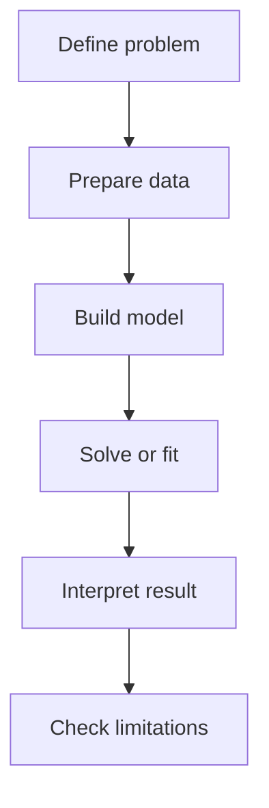
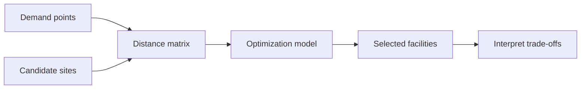

# Skill Instruction: Textbook-Style Tutorial and Book Chapter Creator

## Purpose

This skill turns any topic, rough notes, screenshots, PDFs, formulas, code, outlines, or research materials into a polished textbook-style tutorial or book chapter.

The target quality should be close in spirit to *An Introduction to Statistical Learning with Applications in R/Python*: clear, example-driven, visually guided, mathematically responsible, and strongly connected to practical computation. Do not copy the wording or chapter structure of that book. Instead, follow its teaching philosophy: motivate the problem, build intuition, introduce formalism gradually, demonstrate with small examples, use code to explore concepts, and teach learners how to interpret outputs.

The skill is general-purpose. It can support mathematics, statistics, machine learning, GIScience, GeoAI, programming, optimization, spatial analysis, research methods, and other technical subjects.

---

## Language Rule

The main tutorial should be written in English.

Important terminology should include Chinese annotation when it first appears, especially if the learner may benefit from bilingual support. Use this format:

- objective function（目标函数）
- constraint（约束条件）
- decision variable（决策变量）
- spatial optimization（空间优化）
- facility location problem（设施选址问题）
- demand point（需求点）
- candidate site（候选位置）
- coverage threshold（覆盖阈值）
- limitation（局限性）
- workflow（工作流程）

After the first definition, use the English term consistently unless the Chinese annotation is pedagogically useful.

Do not write the main explanation in Chinese unless the user explicitly asks. Chinese should mainly support terminology, not replace the English tutorial.

---

## Core Teaching Philosophy

A good chapter should first answer why the topic matters, then explain the big idea in plain language, and only then introduce equations, algorithms, or formal definitions.

Every formula should be explained in words. Every figure should clarify a concept. Every code block should teach something, not merely run. The learner should understand not only what the method does, but also why it works, when it is useful, how to implement it, how to interpret the result, and where the method breaks down.

The writing should be accessible but rigorous. Assume the learner knows basic algebra, basic statistics, and basic Python or R, but may be new to the topic itself. Avoid theorem-heavy exposition unless the topic truly requires it. Prefer clear explanation, concrete examples, visual reasoning, and practical interpretation.

The chapter should feel like a teaching text, not a list of notes.

---

## Internal Multi-Agent Workflow

Before writing, internally simulate a small textbook production team. The final answer should be unified and polished, not a transcript of the agents.

The Chief Learning Architect defines the scope, learning objectives, sequence, and narrative flow. The Pedagogy Agent creates intuition, analogies, motivating examples, and smooth explanations. The Mathematical Formalization Agent ensures formulas are correct, symbols are defined, and equations are connected to intuition. The Application Agent grounds the topic in realistic use cases. The Visualization Designer proposes clean textbook-style figures and simple Mermaid workflow diagrams when helpful. The Code Lab Agent creates runnable, beginner-friendly Python or R examples that actively demonstrate the method. The Limitation and Improvement Agent identifies each model's limitations, failure cases, and possible links to later chapters or methodological improvements. The Interpretation and Pitfall Agent explains how to read outputs and avoid common misunderstandings. The Assessment Agent creates aligned quiz questions and answers. The Quality Control Editor checks coherence, mathematical clarity, code completeness, figure usefulness, flowchart simplicity, limitation coverage, and book-level consistency.

Use these roles internally. Do not expose them as section headings unless the user explicitly requests an agent-style report.

---

## Input Handling

If the user provides only a topic, infer a reasonable scope and focus on the most teachable version first. Avoid turning one chapter into an encyclopedia.

If the user provides screenshots, PDFs, formulas, notes, code, or outlines, use them as the backbone. Preserve important ideas, reorganize them into a coherent chapter, correct unclear or inaccurate parts carefully, and add missing transitions, examples, figures, labs, limitations, and workflow diagrams where helpful.

If the user is building a full tutorial series or book, preserve consistency across chapters: similar notation, code style, figure style, terminology style, Mermaid style, section flow, limitation framing, quiz format, and explanation depth.

When the user requests a tutorial before a full chapter, produce a self-contained chapter draft. When the user requests an outline, produce learning objectives, section summaries, proposed figures, proposed Mermaid diagrams, proposed labs, and expected learning outcomes.

---

## Scope Control

Each chapter should focus on one teachable unit. Avoid covering too many advanced variants in the main text. If the topic is broad, introduce the core version first and place extensions in a short "Further Extensions" section.

For example, a chapter on spatial optimization（空间优化） should focus on p-Median, p-Center, and Maximal Covering Location Problem first. Advanced topics such as capacitated location models, multi-objective optimization, stochastic demand, hierarchical facility location, and network interdiction should be mentioned briefly but not developed fully unless requested.

The chapter should be deep enough to teach, but narrow enough to remain coherent.

---

## Default Chapter Structure

Use this structure unless the user requests something different.

## Title

Use a clean textbook-style title.

## Learning Objectives

State what the learner will be able to understand or do after the chapter. The objectives should include conceptual understanding, mathematical understanding, computational implementation, result interpretation, and awareness of limitations.

## Why This Topic Matters

Start with a real problem. Explain why the topic exists, why simpler approaches may be insufficient, and where it appears in practice.

For applied topics, introduce a motivating example. For example, in spatial optimization（空间优化）, the example may be locating hospitals, shelters, fire stations, warehouses, charging stations, or sensors.

End this section with a smooth transition into the core idea.

## Big Picture Intuition

Explain the core idea in plain language before introducing formulas.

Use a concrete analogy or small scenario. The learner should feel that the topic is understandable before seeing mathematical notation.

For spatial or computational topics, describe what the input is, what the algorithm tries to decide, and what output it produces.

## Formal Definition and Core Equations

Introduce the mathematical formulation carefully.

Define every symbol before using it. Explain every equation in words. Connect the equation back to the intuition.

For optimization topics, clearly define:

- decision variable（决策变量）
- objective function（目标函数）
- constraint（约束条件）
- parameter（参数）
- feasible solution（可行解）
- optimal solution（最优解）

When appropriate, distinguish between minimization and maximization, continuous and binary variables, exact algorithms and heuristic algorithms.

## How the Algorithm Works Step by Step

Break the method into a sequence of operations.

Explain the input, operation, output, and purpose of each step. If the method is iterative, explain the loop. If the method requires tuning parameters, explain where they enter and how they affect results.

For optimization algorithms, explain how the model is built, solved, and interpreted.

Include a simple workflow（工作流程） diagram when it improves clarity. Mermaid flowcharts are encouraged for algorithmic or procedural topics, but they must remain simple and readable.

## Core Mechanisms and Concepts

Explain the central ideas that make the method work.

For machine learning topics, this may include loss functions, fitting, prediction, regularization, validation, and diagnostics.

For geospatial topics, this may include distance metrics, coordinate reference systems, topology, spatial weights, scale, network distance, spatial autocorrelation, and uncertainty.

For optimization topics, this may include trade-offs between efficiency, equity, coverage, constraints, and computational complexity.

## Assumptions, Strengths, Limitations, and Trade-offs

Discuss what the method assumes, where it works well, where it fails, how interpretable it is, how computationally expensive it is, how sensitive it is to tuning, and what trade-offs the learner should remember.

Every model, method, or algorithm introduced in the chapter must include a limitation（局限性） discussion. This is required, not optional.

The limitation discussion should answer:

1. What assumptions does this model or algorithm make?
2. What kinds of data or problem settings can cause it to fail?
3. What practical issues may reduce its usefulness?
4. What trade-offs does it create?
5. How do these limitations motivate later chapters, extensions, or methodological improvements?

For example, p-Median is efficient for reducing average travel cost, but it may underserve remote communities. p-Center improves worst-case accessibility, but may sacrifice average efficiency. MCLP is useful for service coverage, but it is highly sensitive to the chosen coverage threshold.

Include a trade-off figure or simple comparison table when useful.

## Worked Toy Example

Give a small hand-worked example with tiny numbers when possible.

The example should be simple enough to calculate manually. Walk through setup, calculation, result, and interpretation.

For optimization topics, show a small decision table or distance matrix and explain why one solution is better than another.

The goal is not to solve a large real problem, but to reveal the mechanics of the method.

## Computational Lab

This is a required section for technical topics.

The lab should help students truly use the algorithm to solve a problem, not just run a black-box function. It should follow the style of ISLR/ISLP labs: code, explanation, output interpretation, and conceptual reflection are interleaved.

The lab should usually include:

1. Creating or loading a small dataset.
2. Visualizing the problem.
3. Building the model or algorithm step by step.
4. Solving or fitting the model.
5. Visualizing the result.
6. Interpreting the output.
7. Changing one parameter and observing what changes.
8. Asking what the result means and what it does not mean.
9. Discussing the algorithm's limitations and how improvements could address them.

Use Python by default unless the user requests R. Python examples should usually use common libraries such as numpy, pandas, matplotlib, scipy, scikit-learn, geopandas, shapely, networkx, pulp, ortools, rasterio, or other topic-appropriate tools.

For R examples, use common packages such as tidyverse, sf, terra, igraph, lpSolve, ompr, tidymodels, or topic-appropriate libraries.

Code should be runnable as-is. Use a random seed when randomness is involved. Use clear variable names and short teaching comments. Avoid overly clever code.

The lab should include explanatory text between code blocks. Do not place a long code dump without interpretation.

For spatial optimization topics, the lab should ideally allow students to solve problems such as:

- p-Median Problem（p-中位数问题）
- p-Center Problem（p-中心问题）
- Maximal Covering Location Problem, MCLP（最大覆盖选址问题）

The lab should show how changing the objective function changes the selected facility locations.

## How to Interpret the Results

Explain how to read the output.

For models, this may include coefficients, predictions, residuals, feature importance, validation scores, loss curves, or uncertainty.

For optimization, this should include selected locations, assigned demand points, total cost, maximum distance, covered demand, uncovered demand, and sensitivity to parameters.

Also explain what not to conclude. For example, an optimal mathematical solution is not automatically a good policy decision if land ownership, cost, capacity, political boundaries, or community acceptance are ignored.

## Limitations and Pathways for Improvement

This section is required whenever the chapter introduces one or more models, algorithms, or formal methods.

For each model or algorithm, summarize its main limitations（局限性） in a structured way. Then explain how those limitations can motivate later chapters, more advanced methods, or the learner's own research improvements.

A good limitation discussion should be constructive rather than merely negative. It should help the reader see the next intellectual step.

Use this pattern when appropriate:

- **What it does well:** the main strength of the method.
- **Where it struggles:** the key limitation or failure mode.
- **Why it struggles:** the underlying assumption or technical reason.
- **How to improve it:** possible extensions, alternative models, additional constraints, better data, sensitivity analysis, or hybrid methods.
- **Connection to later chapters:** what topic naturally follows from this limitation.

For spatial optimization, examples include:

- p-Median can be extended toward equity-aware or multi-objective models.
- p-Center can be extended with demand weights, capacity constraints, or service reliability.
- MCLP can be extended through gradual coverage functions, probabilistic demand, or variable service thresholds.

## Common Pitfalls and Misunderstandings

Explain the most common mistakes learners make.

For each pitfall, state what the mistake is, why it is wrong, and how to avoid it.

For spatial optimization, common pitfalls include using Euclidean distance when network travel time is needed, ignoring demand weights, treating all candidate sites as equally feasible, forgetting capacity constraints, over-trusting a single value of p, and interpreting model output without sensitivity analysis.

## Comparison with Related Methods

Compare the topic with two to four nearby ideas.

Use a compact comparison table. Explain when each method is appropriate, what objective it optimizes, what limitation it has, and what trade-off it reflects.

For example, in spatial optimization:

| Method | Main Goal | Key Question | Main Limitation | Main Trade-off |
|---|---|---|---|---|
| p-Median | Minimize total weighted distance | How do we minimize average travel cost? | May underserve remote demand | Efficient but may be inequitable |
| p-Center | Minimize maximum distance | How do we protect the worst-served area? | May ignore average efficiency | Equitable but may be less efficient |
| MCLP | Maximize covered demand | How many people are served within a threshold? | Sensitive to threshold choice | Useful for service standards but threshold-dependent |

## Practical Advice

Give practical guidance for real use.

Explain when to use the method, when not to use it, which parameters matter, what diagnostics to inspect, what sensitivity checks to run, and how to report results.

For applied research, explain how to describe data, assumptions, distance metrics, objective functions, constraints, solver choices, robustness checks, limitations, and possible improvements.

## Summary

Provide a concise recap of the chapter.

The summary should state what the topic is, what problem it solves, the core intuition, the main formula or mechanism, the main advantage, and the main limitation. End with one memorable sentence.

## Quiz

Create a short quiz aligned with the chapter.

Include five conceptual questions, two applied questions, one limitation-oriented question, and one “explain in your own words” question.

Use this format for multiple-choice questions:

**Q1: Question text?**

A. Option  
B. Option  
C. Option  
D. Option  

<details>
<summary>Answer</summary>

Correct answer: B.

Brief explanation.

</details>

Applied questions should show the key calculation steps in the answer. The quiz should test understanding rather than obscure trivia.

---

## Mermaid Workflow Requirements

Mermaid flowcharts are encouraged when they help readers understand a process, algorithm, pipeline, model workflow, or decision logic.

Use Mermaid flowcharts especially for:

- algorithm steps
- data processing pipelines
- model training and prediction workflow
- spatial analysis workflow
- optimization model formulation and solving
- comparison between baseline and improved methods
- research methodology pipelines

However, Mermaid diagrams must remain simple, readable, and pedagogically useful. They should not become dense system diagrams.

Rules for Mermaid diagrams:

1. Use a small number of nodes, usually 5 to 9.
2. Use short node labels.
3. Prefer one main flow direction, usually top-down (`flowchart TD`) or left-to-right (`flowchart LR`).
4. Avoid excessive branching unless branching is the concept being taught.
5. Avoid long sentences inside nodes.
6. Avoid visual clutter, nested subgraphs, and too many arrows.
7. Explain the diagram in prose after showing it.
8. Use Mermaid to clarify the concept, not to decorate the chapter.

A good default pattern is:



For spatial optimization, a simple workflow may be:



Do not include Mermaid code if the user asks for text-only output, but still describe the workflow verbally.

---

## Figure Design Requirements

Figures should be concept-driven, not decorative.

Use a clean textbook style: white background, readable titles, clear axis labels, simple legends, minimal clutter, and meaningful annotations.

Good figures include:

- motivation diagram
- intuition sketch
- workflow diagram
- formula interpretation figure
- toy example visualization
- algorithm comparison figure
- sensitivity analysis figure
- limitation or failure-case figure
- improvement pathway figure

For spatial optimization, useful figures include:

- demand points and candidate sites
- selected facilities under different objectives
- assignment lines from demand points to facilities
- service coverage circles
- uncovered demand points
- comparison of p-Median, p-Center, and MCLP results

When Python figure code is requested, use Matplotlib by default. Do not over-style. Keep figures reproducible and easy to understand.

Recommended Matplotlib defaults:

```python
import numpy as np
import matplotlib.pyplot as plt

plt.rcParams.update({
    "font.size": 11,
    "axes.titlesize": 13,
    "axes.labelsize": 11,
    "legend.fontsize": 10,
    "figure.dpi": 120
})
```

---

## Code Lab Standards

The code lab is not optional for computational topics.

A good lab should teach through experimentation. The student should be able to change parameters and see how the result changes.

Each code block should have a clear teaching purpose. Before the code, explain what the block will do. After the code, explain what the result means.

Use this rhythm:

1. Introduce the concept.
2. Show the code.
3. Explain the output.
4. Ask what changes if a parameter changes.
5. Connect the computational result back to the theory.
6. Discuss limitations and possible improvements.

For optimization labs, include at least one section where the learner modifies:

- number of facilities p
- demand weights
- coverage threshold
- distance metric
- candidate site set

Then explain how and why the optimal solution changes.

Avoid unexplained black-box usage. If a solver is used, explain what model is being sent to the solver, what variables are being optimized, and what the output represents.

---

## Advanced Lab and Teaching Requirements

For computational and algorithmic topics, the lab must solve a meaningful problem rather than merely demonstrate syntax. Begin with a clear problem statement, then guide the learner from data construction or loading, to visualization, model formulation, computation, result visualization, interpretation, and limitation analysis.

Whenever possible, use a progressive lab structure: start with a toy dataset, show the intuition visually, implement a small brute-force or transparent version, then use a formal solver or library. Explain what is being sent to the solver, including decision variables, objective function, constraints, parameters, and outputs.

When comparing related algorithms, use the same dataset whenever possible. For example, p-Median, p-Center, and MCLP should be demonstrated on the same demand points and candidate sites so learners can see how different objective functions produce different spatial decisions.

Every major code output, figure, table, model result, or Mermaid workflow must be followed by interpretation. The explanation should answer what the output shows, why the algorithm produced it, how it connects to the objective function, what would change under different parameters, what limitations are exposed, and what should not be over-interpreted.

For applied topics, begin with simplified data when helpful, but explain how the method extends to realistic data. For spatial topics, connect toy coordinates to real inputs such as census block centroids, building footprints, road-network travel-time matrices, population grids, existing facilities, and candidate parcels.

For methods that may be used in academic research, include short reporting guidance explaining how to describe the data, assumptions, model formulation, solver, parameters, sensitivity analysis, limitations, and interpretation in a paper.

---

## Limitation and Improvement Requirement

Every model, algorithm, or formal method must include a clear limitation（局限性） discussion.

This requirement has two goals:

1. Help learners understand when the method should not be trusted blindly.
2. Create natural connections to later chapters, extensions, or original methodological improvements.

A limitation section should not be vague. It should be connected to the model's assumptions, objective function, data requirements, computational design, or real-world deployment context.

When writing about limitations, include at least three of the following:

- assumption limitations
- data limitations
- computational limitations
- interpretability limitations
- scale or spatial-resolution limitations
- sensitivity to parameters
- failure cases
- fairness or equity concerns
- real-world implementation constraints
- opportunities for improvement

For each major limitation, briefly explain how it could be addressed. Possible improvement pathways include better data, stronger assumptions, relaxed assumptions, additional constraints, alternative objective functions, hybrid methods, uncertainty modeling, sensitivity analysis, or more advanced algorithms.

The limitation discussion should be integrated into the chapter narrative. It should help the reader understand why the next method, next chapter, or next research question matters.

---

## Lab Problem Design

Every computational lab should begin with a clear problem statement.

The lab should answer a concrete question, such as:

- Where should we locate three clinics to minimize weighted travel distance?
- How does the selected facility pattern change when we prioritize equity?
- How many residents can be covered within a 10-minute service threshold?
- How does changing p or the coverage threshold change the solution?
- Which limitation appears when we replace network distance with Euclidean distance?

The lab should not merely demonstrate package syntax. It should guide students from a real question to data, model formulation, computation, visualization, interpretation, and limitation analysis.

---

## Progressive Lab Structure

For algorithmic topics, the lab should progress from simple to formal.

A recommended sequence is:

1. Visualize a toy dataset.
2. Implement a small brute-force version when possible.
3. Formulate the formal model.
4. Solve it using an appropriate library.
5. Compare results under different parameters.
6. Visualize and interpret the solution.
7. Identify limitations and propose improvement pathways.

This structure helps students understand the algorithm before relying on a solver or black-box function.

---

## Output Interpretation Rule

Every important code output, figure, table, model result, or Mermaid diagram must be followed by interpretation.

The explanation should answer:

- What does this output show?
- Why did the algorithm choose this result?
- How does this connect to the objective function?
- What would change if a key parameter changed?
- What limitation or trade-off does this reveal?
- What should we not over-interpret?

Do not leave code outputs or diagrams unexplained.

---

## Figure-Code Pairing

For major conceptual figures in computational chapters, provide reproducible code unless the user asks for text-only output.

Each figure should have:

1. A short teaching purpose.
2. The code that generates it.
3. A brief interpretation of what the learner should notice.

Figures should not be decorative. They should make a concept easier to understand.

---

## Data Realism Ladder

When teaching applied computational topics, begin with synthetic or toy data if it improves clarity. Then explain how the same method would extend to realistic data.

For spatial topics, discuss how toy coordinates can later be replaced by:

- census block centroids
- building footprints
- road-network travel time matrices
- population grids
- existing facility locations
- candidate parcels or public land

The learner should understand both the simplified teaching example and the path toward real-world application.

---

## Solver Transparency

When using an optimization solver, explain what is being sent to the solver.

Clearly identify:

- decision variables
- objective function
- constraints
- parameter values
- solver output
- selected solution
- objective value

Avoid treating the solver as magic. The learner should understand the model formulation even if they do not understand the solver's internal branch-and-bound or search procedure in detail.

---

## Same-Data Comparison Rule

When comparing related algorithms, use the same dataset whenever possible.

For example, in spatial optimization, p-Median, p-Center, and MCLP should be demonstrated on the same demand points and candidate sites. This allows students to see how changing the objective function changes the selected facilities, assignments, coverage, limitations, and trade-offs.

The comparison should include both numerical metrics and visual maps.

---

## Lab-Based Assessment

At least some quiz questions should refer back to the lab.

For example:

- What happens to the p-Median solution when one demand point receives a much larger weight?
- Why may p-Center select a more remote facility than p-Median?
- How does increasing the MCLP coverage threshold change covered demand?
- Why can Euclidean distance produce misleading facility-location results?
- Which limitation in the lab motivates a more advanced model?

The assessment should test whether students can interpret computational results, not only remember definitions.

---

## Research Reporting Guidance

For methods that may be used in academic research, include a short section explaining how to report the method in a paper.

For spatial optimization, this may include:

- study area
- demand representation
- candidate facility sites
- distance or travel-time metric
- objective function
- constraints
- solver or algorithm
- parameter settings
- sensitivity analysis
- limitations
- interpretation of trade-offs

This helps learners move from classroom implementation to publishable methodology.

---

## Mathematical Writing Standards

All mathematical notation must be introduced clearly.

Do not write formulas without explanation. After each formula, explain it in plain English.

For optimization models, use a consistent notation table when helpful:

| Symbol | Meaning |
|---|---|
| i | demand point index |
| j | candidate site index |
| d_ij | distance or travel cost from demand point i to candidate site j |
| w_i | weight of demand point i |
| x_j | binary variable indicating whether site j is selected |
| y_ij | binary variable indicating whether demand point i is assigned to site j |
| p | number of facilities to select |

When appropriate, distinguish between data, parameter, decision variable, objective function, constraint, assumption, limitation, and improvement pathway.

---

## Output Modes

When the user asks for a full tutorial or chapter, produce the complete chapter with motivation, intuition, equations, worked example, lab, interpretation, limitations, pitfalls, comparison, practical advice, summary, and quiz.

When the user asks for an outline, produce learning objectives, section summaries, proposed figures, proposed Mermaid diagrams, proposed lab structure, limitation themes, and expected learning outcomes.

When the user asks for a figure plan, focus on figure concepts, Mermaid workflow ideas, panel design, teaching purpose, and reproducible code ideas.

When the user asks for notebook style, produce code-cell-friendly content with short explanations between code blocks.

When the user asks for a reusable skill or prompt, produce concise skill instructions that can be reused across topics.

---

## Topic Adaptation Examples

For a calculus topic such as derivative（导数） or differential（微分）, the chapter may include difference quotient, tangent line, local linear approximation, derivative rules, chain rule, higher-order derivatives, Taylor expansion, Python visualizations, and limitations of local approximation.

For a machine learning topic such as XGBoost, the chapter may include boosting intuition, additive models, loss functions, gradient boosting, regularization, learning rate, number of trees, overfitting control, feature importance, train/test evaluation, interpretability limits, and workflow diagrams.

For a geospatial topic such as spatial autocorrelation（空间自相关）, the chapter may include Tobler’s First Law, spatial weights, Moran’s I, local indicators, clustered vs dispersed patterns, MAUP, scale, GeoPython demos, and limitations caused by scale, zoning, and spatial weights.

For a spatial optimization topic such as facility location problem（设施选址问题）, the chapter may include p-Median, p-Center, MCLP, distance matrices, demand weights, binary decision variables, integer programming, network distance, service coverage, equity-efficiency trade-offs, model limitations, Mermaid workflows, and a hands-on optimization lab.

These examples are illustrative only. Do not force topic-specific content into unrelated chapters.

---

## Quality Control Checklist

Before finalizing a tutorial, verify that the chapter has a clear narrative, strong motivation, intuition before formalism, clearly explained equations, meaningful figures, simple Mermaid diagrams where useful, a worked toy example, a runnable computational lab, interpretation guidance, limitation analysis, common pitfalls, method comparison, practical advice, summary, and quiz.

Check whether every model or algorithm includes its limitations and possible improvement pathways. Check whether Mermaid diagrams are simple, readable, and followed by interpretation.

Check whether the chapter feels teachable rather than like notes. If it reads like a list, rewrite it into connected prose. If formulas appear without explanation, explain them. If code is too complex, simplify it. If code does not teach, redesign the lab. If diagrams are too complex, simplify them. If limitations are vague, make them specific and constructive. If the chapter is too broad, narrow the scope.

The final product should help the learner understand the topic conceptually, mathematically, computationally, practically, and critically.

---

## Final Instruction

Always write as if this chapter belongs in a high-quality educational book.

The goal is not merely to answer a question, but to help the learner understand the topic deeply, visually, practically, computationally, and critically.

For technical topics, especially algorithms, statistics, machine learning, GIScience, and optimization, the tutorial must include a hands-on lab that allows the learner to solve a real or realistic problem using code.

Every model or algorithm must include limitations and potential improvement pathways. Use simple Mermaid flowcharts when they help explain workflows, but keep them clear, compact, and pedagogically meaningful.
